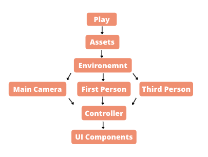

# 3D Virtual Mall
A 3-D virtual environment wherein you can experience the physical shopping experience right in your living room. 

---

# Problem Statement
Online shopping can be a boring experience especially when you are just sitting alone at your home and scrolling through the feed. The amazing experience of exploring the clothes/accessories together with your friends in the mall is an experience we all miss especially with COVID restricting our outside activities. 
 
 ---
 
 # Our Solution
We aim to enable Collaborative Shopping by creating a 3-D virtual environment which will give the shoppers a similar experience of shopping in a mall.
The shoppers will be able to walk walk through the sections of mall with other shoppers, enter private groups wherein they can create an exclusive environment, chat amongst themselves and create shared wish lists to choose the best clothes from the selection.  
The users will also be able to create a personalised avatar and use virtual try-on to find their best fit.  

---
# Feature Impact
### Increased Sales
This 3-D environment will give the users a break from the already existing online shopping interfaces in India by  providing them with a fun shopping experience and hence would attract more users and screen time to Myntra

### Shopper's Community Building 
Our project will help to build an online community of shoppers where they can shop online with their friends or find people with similar shopping patterns and likings and connect with each other

### Influencer Collaborations
This will provide fashion influencers a platform to showcase their fashion sense and collaborate 

### KickStart to Virtual Fashion Advising 
This would give rise to online fashion advising industry, Myntra advisors could join the platform to give personlised shopping advice based on the shopper's avatar

### Traffic Engagement by Gamification of shopping 
Users can walk around the mall, talk to people and have a virtual life, this gamification will lead to increased and more engaged traffic while giving users a fun shopping experience

### Bridges the gap between Online and In-store Shopping
Our model bridges the gap between online and offline shopping by providing users a real life shopping experince

---
# Technology Stack
We have developed the environment on Unity and used C# as a scripting language for implementing features and character controls.
Externally used Photon for chat and networking. Unity Assets, Texture Haven, switchfab for beautifucation of environment.

### Unity 
Cross-platform game engine.
Used to create the virtual enviroment

### C#
C# for scripts, character control, UI componets and chat

### Photon
Networking Engine and
Cross platform Chat Service

### Unity Asset Store
Unity Library for assets and animations

### Sketch Fab
Web platform for 3D models 

### Texture Haven
Platform for high quality scanned texture 

### With the help of official [Unity Documentation](https://docs.unity3d.com/Manual/index.html "Unity ")  

### Flowchart of Components 

---
# Team Twelve Eleven
- Anshita Goel | anshitagoel1999@gmail.com
- Aditi Chawla | caditi49@gmail.com
